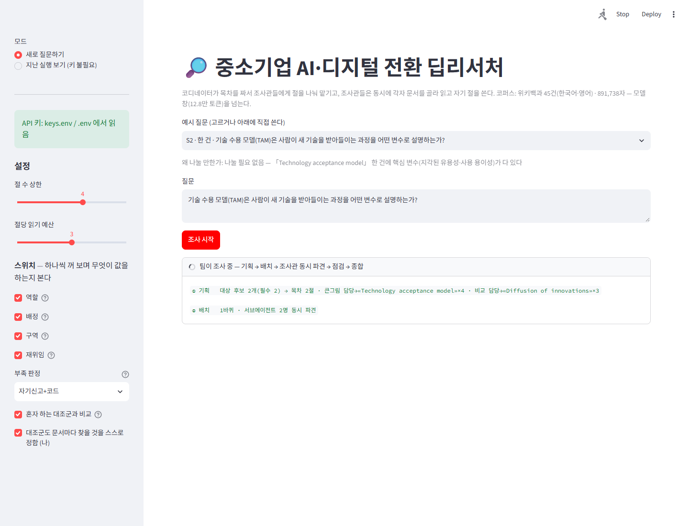
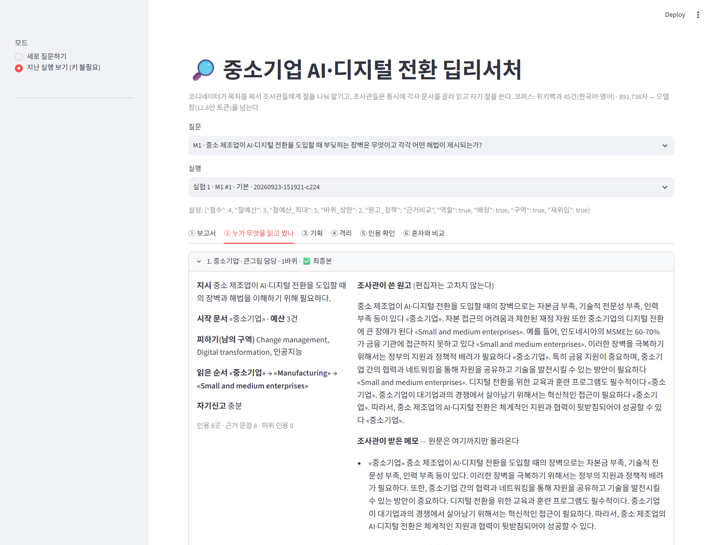
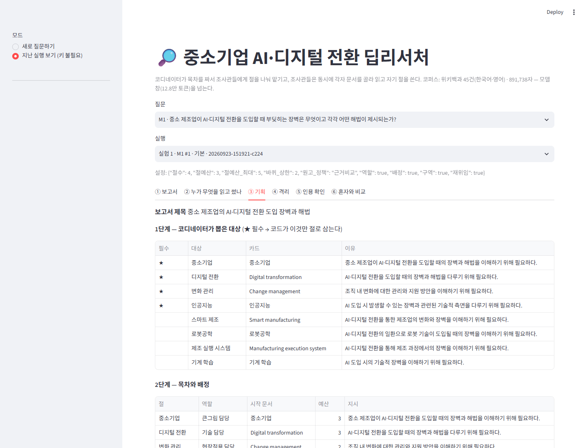
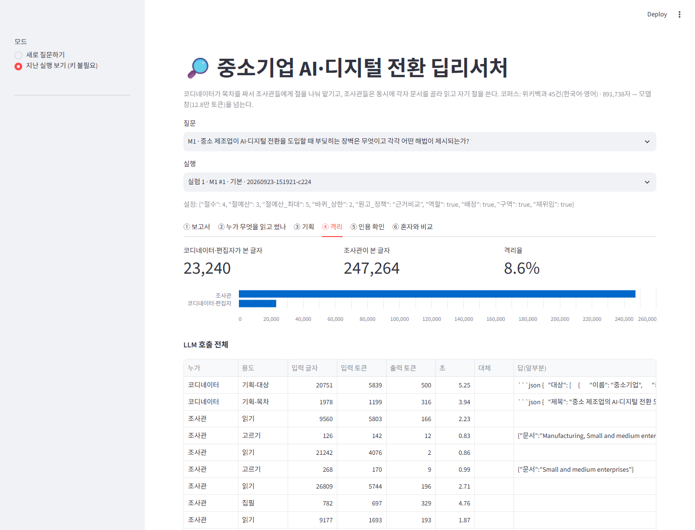
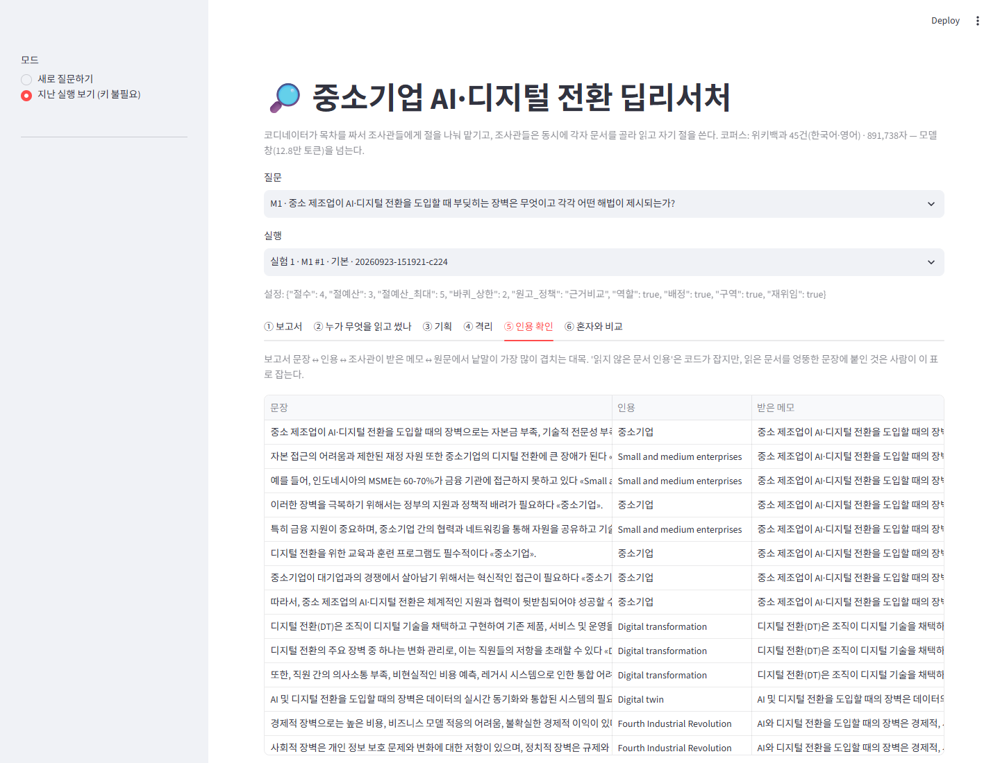
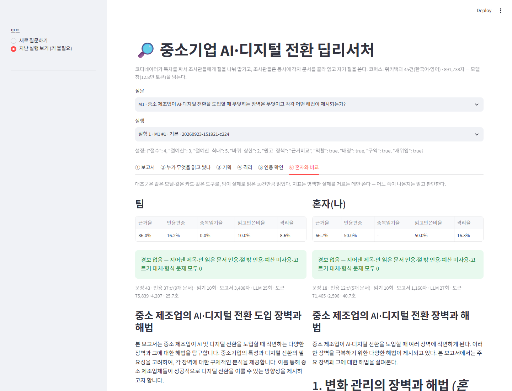

# 중소기업 AI·디지털 전환 딥리서처

**🌐 라이브 데모 → https://sme-deep-research-52pwp9cxzm7krbu7je4jcz.streamlit.app/**
자신의 OpenAI API 키를 왼쪽에 넣고 돌립니다(키·질문·결과는 서버에 저장되지 않음). 키 없이는 「지난 실행 보기」로 실험 기록 297건을 둘러볼 수 있습니다. 무료 플랜이라 한동안 방문이 없으면 앱이 잠들고, 다시 열면 깨어나는 데 몇십 초 걸립니다.

질문 하나를 던지면 **코디네이터가 목차를 짜서 절마다 조사관을 배정하고, 조사관들이 동시에 각자 문서를 골라 읽고 자기 절을 써 오는** 딥리서치 에이전트입니다. 원문은 조사관 쪽에만 남고 위로는 원고만 올라갑니다. 정답표 없이 재고, 장치를 하나씩 꺼 보며 무엇이 값을 했는지 가립니다.

- 주제: 중소기업(SME)의 AI·디지털 전환 — 만든 사람의 본업(「SME AI 주치의」) 도메인
- 코퍼스: 위키백과 45건(한국어 12 · 영어 33) · **891,738자** — gpt-4o-mini 창(12.8만 토큰)의 2.3~3.5배
- 모델: OpenAI `gpt-4o-mini` · LangGraph
- 설계·실험·회고: **[REPORT.md](REPORT.md)** · 과제 규정: [ASSIGNMENT.md](ASSIGNMENT.md)

```
질문 → ① 기획(대상 뽑기 → 코드가 절 구성) → ② 배치(Send 로 N명 동시 파견, 남의 구역 전달)
     → ③ 조사관 ×N (예산만큼 읽고 → 절 원고 + 자기신고) → ④ 점검(부족한 절만 재위임, 2바퀴 상한)
     → ⑤ 종합(절 본문은 그대로, 머리말·맺음말만) → ⑥ 측정(정답표 없는 지표)
```

## 빠른 시작

```bash
python -m venv .venv
```

```bash
.venv\Scripts\python -m pip install -r requirements.txt
```

### API 키

- **웹 데모는 보는 사람이 자기 OpenAI API 키를 왼쪽 칸에 넣고 돌립니다.** 비용은 그 키의 계정에 청구됩니다(한 번 조사에 약 1~2센트, 대조군 비교를 켜면 약 2배). 「키 확인」은 모델 목록만 조회해 토큰을 쓰지 않습니다.
- 넣은 키는 **그 사람의 브라우저 세션 메모리에만** 있습니다. 파일·실행 기록·로그에 남지 않고, 탭을 닫으면 사라지며, 여러 사람이 동시에 써도 서로의 실행에 섞이지 않습니다(방문자마다 따로 만든 클라이언트를 씁니다).
- 명령줄 실행(`graph.py` · `ablation.py` 등)은 `C:\Users\lis29\projects\keys.env` 또는 프로젝트 폴더의 `.env` 에 있는 `OPENAI_API_KEY=sk-...` 를 읽습니다(두 파일 모두 `.gitignore` 에 있음). 다른 경로는 환경 변수 `KEYS_ENV` 로 지정합니다.
- 이 파일이 있는 PC 에서 데모를 띄우면 「이 PC 의 keys.env 키」도 고를 수 있습니다. 여러 사람에게 공개하는 서버는 **공개 모드(`DEMO_PUBLIC=1`)** 로 띄우세요 — 주인 키 선택지를 숨기고, 방문자의 실행을 서버에 저장하지 않아 다음 방문자에게 남의 질문·보고서가 보이지 않습니다.
- **공개 배포(Streamlit Community Cloud)** 절차는 [DEPLOY.md](DEPLOY.md).

### 웹 데모

```bash
.venv\Scripts\python -m streamlit run app.py
```

브라우저에서 `http://localhost:8501` 이 열립니다.

- **새로 질문하기** — 왼쪽에 자기 API 키를 넣고, 예시 질문 11건 중 고르거나 직접 쓰고, 스위치(역할·배정·구역·재위임)를 끄고 켜며 돌려 봅니다. 「혼자 하는 대조군과 비교」를 켜면 팀이 실제로 읽은 건수만큼 혼자 읽은 보고서를 나란히 보여 줍니다.
- **지난 실행 보기** — 실험 기록 297건을 **키와 비용 없이** 둘러봅니다.

### 명령줄

```bash
.venv\Scripts\python graph.py M2
```

```bash
.venv\Scripts\python baseline.py M2 --budget 9 --self-brief
```

```bash
.venv\Scripts\python ablation.py
```

```bash
.venv\Scripts\python metrics.py --test
```

| 명령 | 하는 일 |
|---|---|
| `graph.py M2` | 질문 ID(또는 문장)로 팀을 한 번 돌린다. `--set 재위임=false 절예산=2` 로 설정을 바꾼다 |
| `baseline.py M2 --budget 9` | 혼자 하는 대조군. `--self-brief` 는 문서마다 찾을 것을 스스로 정하는 (나) |
| `ablation.py` | 11질문 × 7조건 × 3반복 = 231회. **끊기면 다시 실행 — 이어서 돈다.** `--exp 2` 는 재위임 실험(66회), `--summary` 는 요약만 |
| `metrics.py` | 기록을 다시 잰다(키 불필요). `--test` 는 문장 분리·인용 규칙 점검 |
| `scripts/compare.py M1` | 나란히 읽기 자료 — 목차·배정, 원고 대 최종본, 인용 대조표 |
| `scripts/collect_corpus.py` | 위키백과에서 코퍼스를 다시 모은다(캐시가 있으면 호출 없음) |
| `scripts/screenshots.py` | 데모 화면 캡처(이 PC 의 Edge 사용, `pip install playwright`) |

## 화면

**진행 — 노드가 끝날 때마다 한 줄씩**



**② 누가 무엇을 읽고 썼나** — 절마다 지시·시작 문서·예산·남의 구역·읽은 순서·받은 메모·원고·자기신고·재위임 채택/기각



**③ 기획** — 1단계 대상(★ 필수) → 코드가 절로 삼는다 · 코드가 바로잡은 배정



**④ 격리** — 코디네이터·편집자가 본 글자 대 조사관이 본 글자, LLM 호출 전체



**⑤ 인용 확인** — 보고서 문장 ↔ 인용 ↔ 조사관이 받은 메모 ↔ 원문 대목



**⑥ 혼자와 비교** — 같은 모델·카드·도구·읽기 건수로 혼자 쓴 보고서와 나란히



## 저장소 구조

```
data/        corpus.json (docs · links · lang) · questions.json (질문 11건과 "왜 나눌 만한가") · collect.log
config.json  도메인에 묶인 값 — 절수 · 절예산 · 바퀴 상한 · 역할 명단 · 스위치 · 부족 판정
graph.py     기획 → 배치 → 조사관 → 점검 → 종합 (LangGraph)
metrics.py   지표 — 정답표·판정 모델 없이
baseline.py  혼자 하는 대조군 (예산 짝 맞춤)
ablation.py  스위치를 하나씩 끄고 재는 실험
app.py       웹 데모 (Streamlit)
scripts/     코퍼스 수집 · 나란히 읽기 · 화면 캡처 (archive/ 에 폐기한 한국어 전용 v1)
output/      runs.jsonl · ablation_runs.jsonl · ablation.json · ablation2_* · reports/ · compare/
             dev/ — 개발 중 버그가 있던 실행 기록(증거로 보관)
docs/        화면 캡처
```

## 출처

코퍼스는 한국어·영어 위키백과 문서입니다(CC BY-SA 4.0). 문서 제목과 수집 방식은 [scripts/collect_corpus.py](scripts/collect_corpus.py) 에 있습니다.
