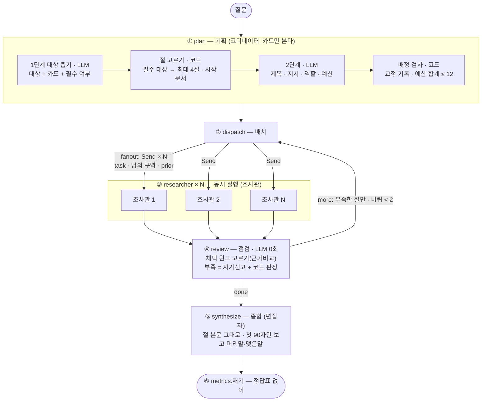
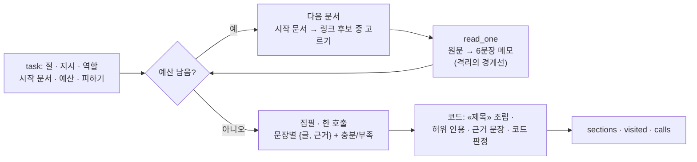

# REPORT — 중소기업 AI·디지털 전환 딥리서처

> 코디네이터 한 명이 목차를 짜고, 조사관 여럿이 동시에 각자 절을 맡아 읽고 쓰는 딥리서치 에이전트.
> 정답표 없이 재고, 장치를 하나씩 꺼 보며 무엇이 값을 했는지 가렸다.

<!-- ✍️ 표시가 붙은 절(8·11장)은 AI 가 먼저 쓴 초안이다. 직접 읽고 판단이 다르면 고쳐 쓴다. -->

## 0. 한눈에

| 항목 | 값 |
|---|---|
| 주제 | 중소기업(SME)의 AI·디지털 전환 — 만든 사람의 본업(「SME AI 주치의」) 도메인 |
| 코퍼스 | 위키백과 **45건**(한국어 12 · 영어 33) · **891,738자** · 내부 링크 247개 |
| 질문 | 11건 — 한 건으로 답이 나오는 것 3 · 여러 갈래 5 · 한 대상 추적 3 |
| 모델 · 틀 | OpenAI `gpt-4o-mini`(temperature 0) · LangGraph |
| 실험 | 실험 1: 11질문 × 7조건 × 3반복 = **231회** · 실험 2(재위임): **66회** |
| 비용 | 실험 1 약 2.20달러 · 실험 2 약 0.69달러 · 개발·데모 약 0.41달러 — **합계 약 3.3달러** |

**결론 네 줄**
1. **나눠 맡기는 것은 값을 했다.** 같은 읽기 건수로 팀의 근거율 80.1% 대 혼자 64.8%/63.7%, 같은 질문·반복 짝 33개 중 30~32개에서 팀이 앞섰다. 흔들림(3~8%p)보다 훨씬 크다.
2. **배정·구역은 '넓게 퍼지기'를 산다.** 끄면 두 절이 같은 문서를 읽는 비율이 4%→31%, 인용 편중이 30→38로 오른다. 근거율은 그대로다.
3. **역할과 재위임은 이 잣대로 값을 증명하지 못했다.** 역할은 차이가 없었고, 자기신고는 약 200개 절에서 한 번도 '부족'을 말하지 않았다. 코드 판정을 더해 재위임을 돌려도 보고서 수준 차이는 없었다.
4. **지표가 못 보는 실패가 있었다.** 읽은 문서를 엉뚱한 문장에 붙인 인용, 요약 단계에서 원문에 없는 내용이 끼어든 것 — 사람이 원문과 대조해서야 보였다.

---

## 1. 주제와 코퍼스

### 왜 이 주제인가
30년 동안 여러 산업에서 "새 기술을 낯선 현장에 들여와 작동시키는 일"을 해 왔고, 지금은 그것을 **SME AI 주치의**(진단 → 적용 → 평가 → 정리)로 좁혀 실증하고 있다. 과제 결과물이 곧 SME 대표를 위한 근거 자료·블로그 소재가 되도록 이 주제를 골랐다. 후보였던 계란 유통 파동사·AI 기업 생태계·메모리얼 캔버스(시대 배경)보다 도메인과 직접 이어진다.

### 코퍼스를 어떻게 모았나 — 두 번 실패하고 세 번째에 정했다

| 판 | 방법 | 결과 | 판단 |
|---|---|---|---|
| v1 | 한국어 위키백과만, 시드 18개 → 1홉 | 50건 · 86.7만 자 | ❌ **폐기.** 디지털 전환·공급망 관리·품질 관리·디지털 트윈·RPA 가 토막글(3천 자 미만)이라 빠지고, 그 자리를 중국어 방·튜링 검사·인공 의식 같은 **AI 철학 문서**가 채웠다(`scripts/archive/`) |
| v2 | 한국어 + 영어 위키백과, 시드 38개 | 50건 · 108만 자 | △ 1홉에 Economics · Technology · Industrial Revolution 같은 **너무 넓은 문서**가 계속 들어왔다. 빼면 다음 넓은 문서가 들어오는 두더지 잡기 |
| **v3** | 넓은 문서 10건 제외 목록 + 상한 45건 + 로봇공학 시드 고정 | **45건 · 891,738자** | ✅ 확정 |

- 현장 주제(예지 정비·MES·디지털 트윈·상태 감시·OEE·TPM·SPC·WMS·차량 관리·텔레매틱스·혁신 확산·기술 수용 모델·변화 관리 …)는 **영어 위키**에서, 한국 맥락이 필요하거나 한국어 문서가 충분히 긴 주제(중소기업·스마트팩토리·ERP·사물인터넷 …)는 **한국어 위키**에서 받았다.
- 언어가 다른 문서끼리도 링크를 잇는다 — 위키 언어 간 연결(langlinks)로 한국어 문서가 가리킨 「디지털 트윈」을 코퍼스의 「Digital twin」에 잇고, 같은 주제의 한↔영 문서(중소기업 ↔ Small and medium enterprises)는 서로 가리키게 했다.
- 6만 자가 넘는 문서 2건(Supply chain management · 3D printing)은 조사관 읽기 상한(6만 자)에 맞춰 잘랐고, 참고 문헌·같이 보기 절은 뺐다.

### 숫자로 보인 전제 — 창에 안 들어간다

| 항목 | 값 | 판정 |
|---|---|---|
| 문서 수 | 45건 | ✅ 30건 이상 |
| 총 글자 수 | 891,738자 ≈ 30만~45만 토큰 | ✅ gpt-4o-mini 창(12.8만 토큰)의 **2.3~3.5배** |
| 내부 링크 | 247개 · 문서당 중앙값 4 | ✅ 탐색 가능 |
| 링크 0개 문서 | Cobot · Statistical process control | 이 문서에서 다른 곳으로 못 간다 |
| 아무도 가리키지 않는 문서 | Demand forecasting · MES · RPA | **배정만이 유일한 경로** (수업의 «거문도 사건» 과 같은 자리) |

### 코퍼스에서 한 '의심하기'
폴더를 옮긴 뒤 캐시만으로 다시 돌렸더니 숫자는 같은데 파일 해시가 매번 달랐다. 원인은 1홉 후보의 **동점 순서를 파이썬 집합 순회가 정하던 것** — 45건째 경계에 동점이 걸리면 실행마다 어느 문서가 들어오는지가 바뀔 수 있었다. 동점을 제목순으로 고정하자 세 번 모두 같은 해시가 나왔고, 코퍼스 3건이 바뀌었다(Logistics · Manufacturing · Business process 가 들어옴).

---

## 2. 질문 세트 — 정답표 대신 "왜 나눌 만한가"

| ID | 유형 | 질문 | 왜 나눌 만한가 |
|---|---|---|---|
| S1 | 한 건 | OEE는 무엇이고 어떻게 계산하며, '세계 수준' 기준은 얼마인가? | **나눌 필요 없음** — OEE 문서 한 건에 다 있다 |
| S2 | 한 건 | 기술 수용 모델(TAM)은 어떤 변수로 설명하는가? | **나눌 필요 없음** — TAM 문서 한 건 |
| S3 | 한 건 | 대한민국에서 중소기업은 어떤 기준으로 정해지는가? | **나눌 필요 없음** — 중소기업 문서 한 건 |
| M1 | 여러 갈래 | 중소 제조업이 AI·디지털 전환을 도입할 때 부딪히는 장벽과 해법은? | 장벽 이야기가 변화 관리·혁신 확산·디지털 전환·중소기업 문서에 흩어져 있다 |
| M2 | 여러 갈래 | 설비 고장·정지를 줄이는 방법들은 무엇이 다르고 어떤 데이터·조건이 필요한가? | 방법마다 문서가 따로 있다 |
| M3 | 여러 갈래 | 제품 품질을 관리하는 방식들은 어떻게 다르고 서로 어떻게 보완하는가? | 방식마다 문서가 따로 있다 |
| M4 | 여러 갈래 | 물류·유통 기업은 운송·재고를 어떤 디지털 수단으로 관리하며 무엇을 전제로 하는가? | 수단마다 문서가 따로 있다 — 양계장 트럭 운행 실증과 이어진다 |
| M5 | 여러 갈래 | 사무 자동화 수단(RPA·ERP·생성형 AI·클라우드)의 적용 범위와 한계는? | 수단마다 문서가 따로 있다 |
| T1 | 한 대상 추적 | 예지 정비는 어떤 기술들이 받쳐 주며 무엇이 먼저 갖춰져야 하는가? | 받쳐 주는 기술이 다른 문서들에 흩어져 있다 |
| T2 | 한 대상 추적 | '4차 산업혁명' 개념은 어디서 나왔고 어떻게 구체화되는가? | 개념 하나를 출발점부터 구현까지 따라가야 한다 |
| T3 | 한 대상 추적 | 새 기술이 조직에 퍼지는 과정과, 수용 모델·변화 관리가 각 단계에 덧붙이는 것은? | 이론 셋이 다른 문서에 있고 흐름 하나로 따라가야 한다 |

**질문을 만들며 짚은 것** — 용어 검색을 해 보니 중소기업을 직접 다루는 문서는 2건뿐이었다. 모든 질문에 "중소기업"을 넣으면 조사관이 늘 빈칸을 만날 것이라, 중소기업 관점은 M1·S3 에만 남기고 나머지는 기술·업무 방식 중심으로 썼다.

---

## 3. 분업 설계

### 3-1. 무엇을 절로 나누는가 — 대상 단위, 관점은 역할로
위키백과 문서는 **기술·개념 하나당 한 건**이다. 절의 축이 문서의 축과 맞아야 조사관이 서로 다른 문서를 읽는다.

| 축 | 예 | 판단 |
|---|---|---|
| **대상 단위** (기술·방법·수단·장벽 유형) | 예지 정비 / 상태 감시 / TPM / 디지털 트윈 | ✅ 채택 — 절 하나 ≈ 문서 묶음 하나 |
| 측면 단위 | 기술 측면 / 조직 측면 / 비용 측면 | ❌ 세 측면 모두 같은 문서가 필요하다 |
| 도입 단계 단위 | 진단 / 적용 / 평가 (본업의 틀) | ❌ 문서가 단계별로 나뉘어 있지 않다 |

### 3-2. 기획 — 한 번에 짜게 했다가, 두 단계 + 코드로 바꿨다

| 판 | 방법 | 드러난 문제 |
|---|---|---|
| ① | 프롬프트로 "대상 단위로 나눠라" | M4 가 '기술적 전제 조건 / 조직적 전제 조건' **측면 절**로 나뉘고, 겹쳐 읽은 문서가 전부 그 측면 절에서 나왔다 |
| ② | 카드에 문서의 절 제목(최대 12개) 추가 | 앞 250자만으로는 디지털 트윈이 '정비'와, 텔레매틱스가 '차량 관리'와 이어진다는 것이 안 보였다 — 부분 개선. T1 에 '도입 조건' 측면 절이 다시 나왔다 |
| ③ 확정 | **1단계 대상 뽑기(모델) → 절 구성(코드) → 2단계 제목·지시·역할·예산(모델)** | 모델이 필수 대상을 빼먹거나 측면 절을 만들 방법이 구조적으로 없어졌다. M1 에 '중소기업' 절이 생기고, S1 은 1절이 됐다 |

- 코디네이터가 보는 것은 **카드뿐** — 제목 + 앞 250자 + 문서의 절 제목. 코퍼스의 2.3%.
- 1단계 대상에는 '필수' 여부를 받는다. 코드가 필수 대상을 관련 순으로 최대 4개까지 절로 삼고, **시작 문서도 그 대상의 카드에서 코드가 고른다.**
- 프롬프트 예시에서 평가 질문과 겹치는 단어(정비·차량 관리·중소기업)를 뺐다 — 자기 질문에 과적합해 개선이 부풀려지는 것을 막으려고.

### 3-3. 역할 명단 — 이 도메인에 맞게 새로 짰다

| 역할 | 프롬프트에 들어가는 한 줄 |
|---|---|
| 큰그림 담당 (기본값) | 주제의 윤곽을 잡고 핵심 개념과 서로의 관계를 간추린다 |
| 기술 담당 | 그 기술이 어떻게 작동하고 어떤 데이터·센서·시스템을 입력으로 받는지 좇는다 |
| 현장적용 담당 | 어떤 업무·공정 문제를 푸는지, 현장에서 어떤 효과를 내는지 정리한다 |
| 도입조건 담당 | 도입의 전제(기반·인력·비용)와 장벽을 자료에 적힌 대로 짚는다 |
| 비교 담당 | 둘 이상을 같은 잣대로 견주어 어디가 다른지 정리한다 |
| 계보 담당 | 개념이 무엇에서 나와 무엇으로 이어졌는지 자료에 적힌 대로 따라간다 |

### 3-4. 배정·구역·예산 규칙
- **배정 검사(코드)** — 목록에 없는 제목, 다른 절과 겹치는 시작 문서, 명단에 없는 역할은 그대로 쓰지 않고 **교정 기록**을 남긴다. 수업 코드처럼 "아무 안 쓴 문서"로 바꾸지 않는다(관련 없는 문서로 출발하게 된다).
- **남의 구역** — 파견 직전에 다른 절의 시작 문서(1바퀴)와 다른 절이 실제로 읽은 문서(재위임 바퀴)를 '피하기' 목록으로 준다.
- **예산** — 코디네이터가 절마다 1~5건을 나누고, 합계는 절수 × 절예산(12)을 넘지 못하게 코드가 자른다. 조사관 안의 `for` 루프가 상한이라 모델이 어길 수 없다. **예산은 끝까지 쓴다** — 대조군과 조건을 맞추려고 "그만둔다" 선택지를 없앴다.
- **다음 문서 고르기** — 읽은 문서의 링크가 후보다. 엉뚱한 제목이면 번호 목록으로 한 번 더 묻고, 그래도 안 되면 후보 첫 번째로 바꾸고 '고르기 대체' 경보로 센다.

### 3-5. 컨텍스트 격리 — 숫자로 증명
- 원문은 `read_one`(한국어 6문장 요약) 안에서만 읽힌다. 조사관은 메모로 절 원고를 쓰고, 위로는 원고만 올린다. 편집자는 절마다 **첫 90자**만 본다.
- LLM 호출마다 '누가·무엇에·몇 자' 를 State 의 `calls` 에 쌓아 **코디네이터·편집자가 본 글자와 조사관이 본 글자를 따로 센다.** 기본 조건 평균 격리율 **13.4%** (예: M1 — 코디네이터 23,240자 대 조사관 247,264자).

### 3-6. 두 번째 원고를 어떻게 할까 — "근거가 줄지 않을 때만 채택"
재위임본은 ① 허위 인용이 없고 ② 읽은 문서를 인용한 문장 수가 이전 원고 이상일 때만 채택한다. 무조건 덮어쓰면 인용을 빠뜨린 재작성본이 멀쩡한 원고를 지운다.
- 실제로 막은 것: S1 「세계 수준 기준」 재작성본이 문장마다 절 제목 «세계 수준 기준»(그런 문서는 없다)을 인용 → 허위 인용으로 **기각**. 실험 2 의 M2 「예측 유지보수」 재작성본은 근거 문장 11→8 → **기각**.

### 3-7. 누가 "부족하다"고 말하는가 — 자기신고 + 코드 판정
- 수업대로 조사관이 원고와 같은 호출에서 '충분/부족'을 스스로 적는다(추가 비용 0).
- 그런데 **약 200개 절에서 자기신고는 한 번도 '부족'을 말하지 않았다**(초기에는 "문장이 12개 미만"을 부족으로 신고하는 오용이 있어 "내용 기준으로만" 판단하게 고친 뒤부터).
- 그래서 코드 판정을 더했다: 이번에 읽은 문서 절반 이상이 '관련 없음'이거나 근거 문장이 6개 미만이면 부족(`부족_판정 = "자기신고+코드"`, 현재 기본값).

### 3-8. 종합
편집자는 절 본문을 고치지 않고 머리말·맺음말만 쓴다 — 문체 통일을 포기하고 인용 정확성을 지켰다. 절 순서는 기획의 번호로 복원한다(동시 실행이라 도착 순서가 매번 다르다).

---

## 4. 지표 — 무엇이 어느 장치의 신호인가

정답표도 판정 모델도 쓰지 않는다. 완성된 보고서 문자열과 실제로 읽은 문서만 본다. 저장된 기록만으로 다시 계산되며(키 불필요·결정적), 문장 분리 규칙은 `graph.문장들` 한 곳에만 있다.

### 높낮이를 견주는 신호

| 지표 | 한 줄 정의 | 보는 장치 |
|---|---|---|
| 근거율 | 인용이 붙은 문장 ÷ 전체 문장 (`#` 머리글 줄은 분모에서 뺀다, 머리말·맺음말은 남긴다) | 집필 · 예산 · 재위임 |
| 인용 편중 | 가장 많이 인용된 문서 ÷ 전체 인용 | 배정 · 구역 |
| 중복 읽기율 | 두 절 이상이 읽은 문서 ÷ 읽은 문서 (팀 전용) | 구역 |
| 읽고 안 쓴 비율 | 읽었지만 인용하지 않은 문서 ÷ 읽은 문서 | 탐색 · 배정 품질 |
| 격리율 | 코디네이터·편집자가 본 글자 ÷ 전체가 본 글자 | 격리 설계 |

### 0 이어야 하는 경보

| 경보 | 한 줄 정의 | 보는 장치 |
|---|---|---|
| 지어낸 제목 인용 | 코퍼스에 없는 제목을 인용 | 집필 |
| 안 읽은 문서 인용 | 읽은 적 없는 문서를 인용 | 집필 |
| 절 밖 인용 | 그 절 조사관이 읽지 않은 문서를 그 절에서 인용 (팀 전용) | 격리 · 집필 |
| 예산 미사용 | 읽은 수 < 배정 예산 | 탐색 · 대조군 공정성 |
| 고르기 대체 | 모델이 두 번 다 엉뚱한 문서를 골라 후보 첫 번째로 바뀜 | 탐색 |
| 집필 형식 문제 | 문장별 구조 실패 + 인용 형식을 코드가 고친 곳 | 집필 파이프라인 |
| 빈 절 · 입력 잘림 | 본문 100자 미만 절 + 6만 자 상한에서 잘린 읽기 | 파이프라인 |

### 이 지표를 믿어도 되는가
- **알려진 실패를 잡는지 옛 기록에 적용해 봤다** — 인용 형식 버그가 있던 v0 는 근거율 36%·예산 미사용 6, 인용이 빠진 v1 은 근거율 12%/0%·고르기 대체 6. 계기판이 실패를 드러낸다.
- **수업 코드의 숨은 문제 두 가지를 고쳤다** — ① 인용 셀 때 `if c in DOCS` 로 코퍼스에 없는 제목을 **조용히 걸러** 지어낸 제목이 어떤 지표에도 안 나타났다 → 경보로 드러낸다. ② 인용이 마침표 뒤에 오면(`…이다. «문서»`) 문장 분리기가 그 인용을 **다음 문장**에 붙였다 → 조립할 때 인용을 마침표 앞에 둔다.
- `python metrics.py --test` — 문장 분리·머리글 제외·인용 위치·지어낸 제목 경보가 바뀌면 깨진다. 실험 기록마다 지표 코드의 지문(`7f58e91808`)을 남겨 도중에 규칙이 바뀌지 않았음을 확인했다.
- **한계** — 근거율은 "인용이 붙었는가"만 본다. 그 인용이 문장을 **뒷받침하는가**는 못 본다(8장).

---

## 5. 파이프라인 구조도



**조사관 한 명 안에서 (노드 안의 작은 에이전트)**



**State — 노드들이 함께 쓰는 칠판**

| 필드 | 누가 채우나 | 리듀서 |
|---|---|---|
| `question` · `설정` | 시작 | — (설정을 State 에 실어 스위치가 실제 코드 경로를 바꾸게 했다) |
| `plan` | ① 기획 · ④ 점검 | 통째로 교체 |
| `sections` | ③ 조사관 | `operator.add` — 재위임본까지 전부 쌓인다 |
| `visited` | ③ 조사관 | `operator.add` — (절 번호, 문서) |
| `calls` | 모든 LLM 노드 | `operator.add` — 격리율의 재료 |
| `report` | ⑤ 종합 | 통째로 |
| `log` | 모든 노드 | `operator.add` |
| `task` · `prior` | ② 배치 → ③ (`Send` 로 한 명에게만) | — |

---

## 6. 실험 설계

### 조건
| 실험 | 조건 | 반복 | 실행 |
|---|---|---|---|
| 1 | 기본 · 배정끔 · 구역끔 · 역할끔 · 재위임끔 · 혼자(가) · 혼자(나) | 3 | 11 × 7 × 3 = 231 |
| 2 | 기본(자기신고+코드) · 재위임끔(같은 판정 설정) | 3 | 11 × 2 × 3 = 66 |

스위치는 **한 번에 하나만** 끈다(수업은 배정·구역을 함께 껐다).

### 대조군 — 혼자 하는 오케스트레이터
팀과 다른 것은 **"나눠 맡기느냐" 하나뿐**이어야 한다. 대조군은 팀의 함수를 그대로 가져다 쓴다(`cards` · `read_one` · `고르기` · `후보목록` · `문장조립` · `인용형식교정` · `문장건지기`).
- 읽기 예산 = 같은 질문·같은 반복의 기본 실행이 **실제로 읽은 건수** (짝 맞춤 — 코디네이터가 예산을 다 배정하지 않는 경우가 있어서).
- **(가)** 질문 전체를 읽기 지시로(수업 방식) · **(나)** 다음 문서를 고르는 같은 호출에서 "이 문서에서 찾을 것"도 스스로 정한다. 파일럿에서 (가)는 10건 중 6건이 '관련 없음'으로 돌아왔는데, 이것이 "나눠 맡긴 덕분"인지 "대조군 손발을 묶은 것"인지 판단이 갈려 **둘 다** 돌렸다.
- 한계: 대조군도 원문 대신 요약만 쌓는다(원문 전체는 창에 안 들어간다). 그래서 이 비교는 '창을 넘는가'가 아니라 **'나눠 맡기는 것이 값을 하는가'**를 잰다.

### 공정성의 잣대 다섯 가지 (실험에 점검표로 넣었다)
| 잣대 | 확인 |
|---|---|
| ① 같은 것을 받았나 | 같은 함수를 쓰는지 코드로 확인 |
| ② 같은 만큼 썼나 | 읽기 건수 짝 맞춤 · 원문 읽은 글자 수 비교 |
| ③ 막히지 않았나 | 예산 미사용·고르기 대체·형식 문제·잘림 경보가 양쪽 0 인가 |
| ④ 같은 자로 쟀나 | 같은 `metrics.재기`, 같은 지표 지문 |
| ⑤ 운이 아니었나 | 같은 횟수 반복, 흔들림보다 큰 차이만 인정 |

**일부러 같게 하지 않은 것** — 절마다 따로 읽고 쓰기(동시 파견), 코디네이터의 목차·배정, 재위임 — 비교 대상이다. LLM 호출·토큰은 맞추지 않고 비용으로 보고한다.

**한 줄 점검** — "결과가 반대로 나왔다면, 나는 이 설정이 상대에게 유리했다고 항의했을까?"

---

## 7. 결과

### 실험 1 — 조건별 (33회 평균, 괄호는 최소~최대)

| 조건 | 근거율 | 인용 편중 | 중복 읽기 | 읽고 안 씀 | 격리율 | 보고서 글자 |
|---|---|---|---|---|---|---|
| **기본** | **80.1** (50~90) | **30.1** | 4.2 | 24.6 | 13.4 | 2,436 |
| 배정 끔 | 80.7 | 38.8 | **31.1** | 17.8 | 12.1 | 2,543 |
| 구역 끔 | 82.3 | 38.0 | **32.2** | 14.8 | 12.6 | 2,648 |
| 역할 끔 | 80.0 | 31.8 | 4.5 | 29.3 | 13.5 | 2,409 |
| 재위임 끔 | 80.5 | 29.5 | 3.7 | 26.4 | 13.6 | 2,403 |
| 혼자(가) | 64.8 | 43.5 | – | 47.3 | 17.4 | 1,152 |
| 혼자(나) | 63.7 | 43.5 | – | 53.8 | 17.0 | 1,213 |

공정성 점검: 짝 66개 중 문제 있는 짝 2개(대조군 형식 오류 — 건져서 복구, 경보로만 남김) · 스위치 확인: 어긋난 기록 **0건**.

### 질문 유형별 근거율 / 인용 편중

| 조건 | 한 건 (S) | 여러 갈래 (M) | 한 대상 추적 (T) |
|---|---|---|---|
| 기본 | 69.1 / 51.1 | **85.0 / 22.2** | **83.1 / 22.4** |
| 배정 끔 | 70.2 / 53.8 | 84.9 / 31.2 | 84.4 / 36.4 |
| 구역 끔 | 74.8 / 50.7 | 85.4 / 29.5 | 84.5 / 39.4 |
| 역할 끔 | 70.1 / 51.6 | 83.4 / 23.9 | 84.1 / 25.0 |
| 혼자(가) | 55.2 / 57.3 | 66.2 / 37.2 | 72.1 / 40.2 |
| 혼자(나) | 50.5 / 72.2 | 72.2 / 28.9 | 62.7 / 38.9 |

### 흔들림 — 무엇을 '차이'로 읽을까
- 같은 설정 3회의 근거율 폭은 질문별 1~4%p(S3 만 20%p).
- **실험 2 의 T1 은 두 조건 모두 재위임이 0회 — 사실상 같은 코드 경로인데도 3회 평균 근거율이 78.4 대 86.4, 8%p 벌어졌다.** 3회 평균끼리도 이만큼은 우연이다.
- 그래서 **5~8%p 안의 차이는 '차이 없음'**으로 읽었다. 구역 끔의 근거율 +2.2%p, 역할 끔의 −0.1%p 는 효과가 아니다.

### 해석
1. **팀 대 혼자** — 짝 33개 중 근거율 30개(가)·32개(나)에서 팀이 높고, 편중은 25~27개에서 팀이 낮다. 차이(약 16%p)가 흔들림보다 훨씬 크다. 보고서는 약 2배 길고, LLM 호출·입력 토큰은 거의 같다(여러 갈래 기준 23.7회·6.0만 대 22.1회·6.2만). 혼자 쪽은 읽은 문서의 절반가량을 쓰지 못했다.
2. **좁은 읽기 지시만으로는 설명되지 않는다** — 혼자(나)는 전체 평균이 (가)와 같고, 유형별로 방향이 뒤집혔다(여러 갈래 +6.0, 한 대상 추적 −9.4). 팀이 앞선 몫은 **절마다 따로 써서 한 사람이 다 쓰는 부담을 나눈 것**에 더 가깝다.
3. **배정·구역** — 끄면 중복 읽기 4→31~32%(20~24/33칸), 편중 30→38~39. 근거율은 오히려 조금 오르고 읽고 안 쓴 비율은 줄었다 — 구역이 조사관을 **주변 문서로 밀어내고 그 문서를 결국 못 쓰게 하는** 대가가 보인다.
4. **역할** — 모든 지표가 흔들림 안. 계보 담당이 필요할 것으로 본 T2·T3 에서도 차이가 없었다.
5. **재위임** — 실험 1 에서 0회 발동. 실험 2 에서 코드 판정을 더하자 11/33 실행에서 돌았고(부족 26절, 전부 코드 판정), 재위임받은 절은 대체로 좋아졌다(근거 문장 6→12, 5→10 …). 그러나 **보고서 수준 차이는 없었다**(80.3 대 81.2) — 재위임된 절이 전체의 4분의 1 남짓이고 근거율은 비율이라 잘 안 움직인다. 읽기는 늘었다(M2 12건 대 9.7건).
6. **한 건짜리 질문** — 코디네이터가 1~2절로 나눠 구조가 사실상 조사관 한 명이 된다. 편중 51%, 읽은 문서의 35%를 버렸다(예산을 채우려고 주변 문서를 읽었다). **이 구조를 쓸 이유가 약한 질문**이다.

| 장치 | 값을 했나 |
|---|---|
| 나눠 맡기기 | ✅ 뚜렷하게 |
| 배정 · 구역 | ✅ 넓게 퍼지게 한다 (근거율에는 무관) |
| 역할 | ❌ 차이 없음 |
| 재위임 (자기신고) | ❌ 발동하지 않음 |
| 재위임 (코드 판정) | △ 절 수준 개선, 보고서 수준 차이 없음, 읽기 비용 증가 |
| 두 번째 원고 규칙 | ✅ 나쁜 재작성본 기각 3건 확인 |

---

## 8. 결과물을 직접 읽고 판단하기 ✍️

> 지표는 명백한 실패를 거르는 데만 썼다. 아래는 같은 질문의 보고서 네 편(기본 · 구역 끔 · 혼자(가) · 혼자(나))을 나란히 읽고 적은 판단이다. 자료: [M1](output/compare/M1_1.md) · [T1](output/compare/T1_1.md) · [S3](output/compare/S3_1.md)

### M1 (도입 장벽) — 팀이 낫다
- **왜** — 팀은 네 갈래(중소기업 여건 · 디지털 전환 · 변화 관리 · AI)를 모두 다루고, 구체적인 장벽을 자료에서 가져왔다: 4차 산업혁명 문서의 경제적·사회적·정치적·조직적 장벽 분류, 산업 AI 문서의 데이터 품질·블랙박스·데이터 드리프트, 중소기업 문서의 "MSME 60~70% 가 금융 기관에 접근 못 함". 혼자(나)는 2절뿐이고 둘째 절은 장벽이 아니라 디지털 트윈 소개로 흘렀다.
- **마음에 안 드는 대목** — 팀의 「변화 관리」 절은 장벽·해법이 아니라 정의("대학에서 독립 학문으로 가르친다")에 머물렀다. 그리고 「중소기업」 절에 원문에 없는 문장이 섞였다(아래 추적 ①).

### T1 (예지 정비 추적) — 지표와 읽은 인상이 엇갈린다
- 지표로는 팀(근거율 84.7)이 혼자(가)보다 앞선다. 그런데 읽어 보면 **혼자(가)가 질문에 더 곧장 답한다** — 상태 감시 기법(진동·온도·압력), 예지 정비의 구성 요소, 설비 중요도 분류.
- 팀은 목차가 인공지능 / 예지 정비 / 스마트팩토리로 나뉘었고, 「인공지능」 절은 의료 영상·현대자동차 수요 예측 같은 일반론이 많다. **센서·IIoT 가 빠져 "무엇이 먼저 갖춰져야 하나"에 약하다**(아래 추적 ②).
- 이 질문에서는 나눠 맡긴 것이 아니라 **나누는 방식(목차)**이 결과를 갈랐다.

### S3 (한 건짜리) — 팀이 낫지만, 나눈 덕분은 아니다
- 팀의 1절(한국 기준)은 원문과 잘 맞는다("2022년 약 800만 개", "소유와 경영이 분리되지 않는다" 모두 원문 확인). 2절(EU·미국·호주 기준)은 질문이 묻지 않은 내용이다.
- 혼자(가)는 2절에서 **한국 기준을 지어냈다**(아래 표). 차이를 만든 것은 나눠 맡기기가 아니라 1절 조사관이 한 문서를 좁은 지시로 꼼꼼히 읽은 것이다.

### 인용이 제자리에 붙었나 — 원문과 대조

| 보고서 | 문장 | 인용 | 원문 확인 | 판정 |
|---|---|---|---|---|
| M1 팀 1절 | "인도네시아 MSME 의 60-70% 가 금융 기관에 접근하지 못한다" | «Small and medium enterprises» | 원문에 그대로 있다 | ○ |
| M1 팀 1절 | "장벽으로는 자본금 부족, 기술적 전문성 부족, 인력 부족" | «중소기업» | 원문 '디지털' 0회 · '인력' 0회 | ✕ |
| M1 팀 1절 | "디지털 전환을 위한 교육과 훈련 프로그램도 필수적이다" | «중소기업» | '교육'은 업종 분류("교육 서비스업")에 한 번 | ✕ |
| M1 혼자(나) 1절 | "이러한 저항은 직원들이 새 시스템에 적응하는 데 어려움을…" | «인공지능» | '저항' 0회 · '직원' 0회 | ✕ |
| M1 혼자(나) 2절 | "중소 제조업은 기술 인프라 부족이라는 장벽에 부딪힌다" | «Digital twin» | 중소기업 이야기 없음 | ✕ |
| S3 팀 1절 | "2022년 기준 약 800만 개", "소유와 경영이 분리되지 않는다" | «중소기업» | 둘 다 원문에 있다 | ○ |
| S3 혼자(가) 2절 | "직원 300명 이하 또는 연매출 500억 원 이하 … 중소기업청이 규정" | «Small and medium enterprises» | 원문에 **Korea 0회** — 한국 기준을 지어냄 | ✕ |
| T1 혼자(가) 1절 | "예지 정비는 빅 데이터 기술에 기반하며…" | «빅 데이터» | 원문에 정비·유지보수 0회 — 추론으로 붙인 인용 | ✕ |

팀과 혼자 모두 **'인용 장식'**(자료에 없는 일반론 + 그럴듯한 문서 제목)이 있고, 혼자 쪽이 더 잦다 — 메모의 절반이 '관련 없음'이라 쓸 재료가 모자랐기 때문으로 보인다. 지표는 "읽은 문서를 인용했다"로 모두 통과시킨다. **읽은 문서를 엉뚱한 문장에 붙인 것은 사람만 잡는다**는 것을 실제로 확인했다.

### 마음에 안 드는 대목을 어디까지 추적했나

**추적 ① — M1 팀 「중소기업」 절의 "자본금·인력 부족, 교육·훈련 프로그램 필수"**

| 단계 | 원문에 없는 내용이 있었나 |
|---|---|
| 원문 「중소기업」 (법적 정의 문서, '인력' 0회 · '디지털' 0회) | 없음 |
| **읽기(`read_one`) 메모** | **있음 ← 여기서 생겼다** |
| 조사관 원고 | 있음 (메모를 옮김) |
| 최종 보고서 | 있음 (편집자는 본문을 고치지 않음) |

글을 쓴 조사관이 아니라 **요약 단계**가 원인이다. "도입 장벽"이라는 지시를 받은 요약기가, 그런 내용이 없는 정의 문서를 읽으며 **지시에 맞춰 빈칸을 채웠다.** 더 깊게는 **코퍼스의 한계** — 한국 중소기업의 디지털 전환 실태를 다룬 자료가 코퍼스에 없어서, '중소기업 여건' 절이 기댈 곳이 법적 정의 문서뿐이었다.

**추적 ② — T1 팀 보고서에 센서·IIoT 가 없는 이유**
- 세 번 모두 1단계에서 코디네이터가 대상 카드로 **"Internet of Things", "Machine learning", "Robotics"** 를 적었다. 코퍼스에는 «사물인터넷», «기계 학습», «로봇공학» — **한국어 제목**으로 들어 있다.
- 배정 검사가 "목록에 없는 제목"으로 빼면서, 예지 정비를 받쳐 주는 핵심 기술이 목차에서 사라졌다(기획 탭의 교정 기록). 모델의 지어낸 제목을 막는 장치가, 언어만 다른 **정당한 제목**까지 막은 것이다.

**추적 ③ — M4 에 텔레매틱스·차량 관리 절이 한 번도 없는 이유**
- 세 번의 목차가 똑같이 물류 / 디지털 전환 / 산업용 사물인터넷 / 창고 관리 시스템이었다(temperature 0 이라 기획이 거의 결정적이다). 1단계가 '운송'을 폭넓은 「Logistics」 한 건으로 묶었다 — 양계장 트럭 운행 실증과 가장 가까운 문서가 정작 쓰이지 않았다.

---

## 9. 에이전트 결과를 의심해서 잡은 것

과제가 경고한 세 가지 사고와, 그 밖에 개발 중 실제로 잡은 것.

| 사고 | 무엇이 있었나 | 어떻게 잡았나 · 고쳤나 |
|---|---|---|
| **스위치를 껐다고 로그만 찍고 경로는 그대로** | 설정을 전역 변수로 두면 한 프로세스에서 설정이 섞일 수 있다 | 설정을 State 에 싣고, 실험 요약에 **스위치 확인**(배정끔인데 시작 문서가 있나 등) — 어긋난 기록 0건 |
| **지표가 좋아진 줄 알았는데 문장 분리가 바뀜** | 수업 코드는 마침표 뒤 인용을 다음 문장에 붙였다 | 문장 분리를 한 곳에만 두고 `--test` 로 고정, 기록마다 지표 지문 |
| **한 번 돌린 결과로 단정** | 같은 설정도 3회 평균끼리 8%p 가 우연으로 났다(실험 2 T1) | 3회 반복, 흔들림보다 큰 차이만 인정 |
| 코퍼스가 실행마다 바뀜 | 동점 순서를 집합 순회가 정함 | 제목순 고정, 해시 세 번 동일 확인 |
| 인용이 안 붙음 | 프롬프트의 "[ ] 안 제목 그대로"를 모델이 `[제목]` 으로 씀 → 고치자 인용을 아예 뺌 | 문장별 `{글, 근거}` 구조로 받고 코드가 «» 를 붙인다 |
| 예산을 안 씀 | "더 읽을 것이 없으면 그만둔다" 선택지 | 선택지를 없애 대조군과 조건을 맞춤 |
| 부족 신고 오용 | "문장이 12개 미만"을 부족으로 신고 | 내용 기준으로만 판단하게 — 그 뒤로는 아예 '부족'을 안 말함(3-7) |
| 자기 질문에 과적합 | 기획 프롬프트 예시에 평가 질문의 단어가 들어가 있었다 | 일반 표현으로 교체 |
| **대조군 손발을 묶음 ①** | 대조군이 [이미 읽음] 목록의 제목을 베껴 고르기 대체 3회 → 알파벳 첫 문서(3D printing·Cobot)를 읽음 | 2차는 번호 목록으로 묻게 — 대체 0 |
| **대조군 손발을 묶음 ②** | 대조군 집필 JSON 이 조금 깨지자 인용을 하나도 못 읽어 **근거율 0%** 로 4칸 기록 | 공정성 점검표가 잡음 → 문장 조각을 건지는 함수를 팀·대조군 공용으로, 4칸만 다시 → 혼자(가) 54.8→**64.8%**. 고치지 않았으면 팀의 우위가 10%p 부풀려졌다 |
| 패치 스크립트 실수 | 문자열 치환이 실패했는데 다음 명령이 이어서 실행돼 이전 버전으로 5회가 더 돌았다 | 버리지 않고 '같은 설정 반복' 표본으로 썼다(목차가 실행마다 달라짐을 보여 준 첫 증거) |

개발 중 버그가 있던 실행 기록은 모두 `output/dev/` 에 증거로 남겼다.

---

## 10. 데모 설계

`streamlit run app.py` → `http://localhost:8501`. 실행법과 화면 전체는 [README.md](README.md).
**공개 배포**: https://sme-deep-research-52pwp9cxzm7krbu7je4jcz.streamlit.app/ (Streamlit Community Cloud, 공개 모드 — 방문자가 자기 키로 돌린다)

| 화면 | 신경 쓴 점 |
|---|---|
| 진행 로그 | 노드가 끝날 때마다 한 줄씩 — 기획 → 배치 → 조사관(동시) → 점검 → 종합의 **흐름이 보이게** |
| **② 누가 무엇을 읽고 썼나** | 이 과제의 요점. 절마다 지시·시작 문서·예산·남의 구역·**읽은 순서**(이번 바퀴 새로 읽은 것 굵게)·**조사관이 받은 메모**(원문은 여기까지만 올라온다)·원고·자기신고(자기신고 / 코드 판정 구분)·재위임본 채택/기각 |
| ③ 기획 | 1단계 대상(★ 필수)과 **코드가 바로잡은 기록** — 추적 ②를 이 화면에서 찾았다 |
| ④ 격리 | 코디네이터·편집자 대 조사관이 본 글자, 호출 전체와 모델의 답 앞부분 |
| ⑤ 인용 확인 | 보고서 문장 ↔ 인용 ↔ 받은 메모 ↔ 원문 대목 — 사람이 인용을 대조하는 곳. 추적 ①을 이 화면에서 찾았다 |
| ⑥ 혼자와 비교 | 같은 읽기 건수로 혼자 쓴 보고서와 나란히 |
| 스위치 · 부족 판정 | 왼쪽에서 켜고 끄며 직접 절제 실험 |
| 지난 실행 보기 | 실험 297건을 **키·비용 없이** — 발표·리뷰 때 돈을 쓰지 않고 보여 줄 수 있게 |
| 키 | **보는 사람이 자기 키를 넣고 돌린다.** 키는 방문자의 세션에만 있고(contextvar → LangGraph 병렬 노드까지 전달, 방문자마다 따로 만든 클라이언트), 파일·기록·로그에 남지 않는다. 처음 만든 판은 입력한 키를 `os.environ` 에 넣어 **프로세스 전체가 공유** — 여러 사람이 동시에 쓰면 한 방문자의 키로 다른 방문자의 실행이 돌 수 있었다. 「키 확인」은 모델 목록만 조회한다 |
| 공개 모드 | `DEMO_PUBLIC=1` — 주인 키 선택지를 숨기고, 방문자 실행을 서버에 **저장하지 않는다**(처음 판은 데모 실행을 모두 `runs.jsonl` 에 남겨 '지난 실행 보기'로 **다음 방문자에게 남의 질문·보고서가 보일** 수 있었다). 배포 절차는 [DEPLOY.md](DEPLOY.md) |

| | |
|---|---|
|  |  |
|  |  |

---

## 11. 회고 ✍️

### 가장 공들인 부분
- **대조군을 공정하게 만드는 일.** 팀이 이겼다는 말을 믿을 수 있으려면 상대가 손발이 묶이지 않았다는 증거가 있어야 했다. 공정성의 잣대를 다섯 가지로 먼저 정하고, 그것을 실험 코드 안의 점검표로 만들었다. 그 점검표가 실제로 대조군 쪽 두 가지 불공정(고르기 대체, JSON 파싱)을 잡아냈고, 고치자 격차가 10%p 줄었다. **공정성을 나중에 눈으로 확인하는 것이 아니라 실행마다 자동으로 검사하게 한 것**이 가장 값졌다.
- **목차의 축.** 프롬프트로 "대상 단위"를 아무리 강조해도 측면 절이 다시 나왔다. 결국 모델에게는 대상을 늘어놓게만 하고 **절을 짜는 일은 코드가** 하게 바꾸자 구조적으로 사라졌다. "모델에게 부탁하지 말고, 어길 수 없게 만든다"는 교훈.

### 틀렸던 것 · 꺼 봐야 알았던 것
- **역할은 이름표였다.** 이 도메인에 맞게 역할을 새로 짰고 계보 담당이 T2·T3 에서 값을 할 것으로 예상했지만, 끄나 켜나 차이가 없었다.
- **자기신고는 신호가 아니었다.** 수업의 결정("무엇이 비었는지 문장으로 얻는 유일한 공짜 방법")을 그대로 따랐는데, gpt-4o-mini 는 약 200개 절에서 한 번도 '부족'을 말하지 않았다. 재위임 루프는 코드가 셀 수 있는 신호를 더해서야 돌았다.
- **지표가 좋다고 보고서가 좋은 것은 아니었다.** T1 은 지표로는 팀이 앞서지만 읽어 보면 혼자 쓴 쪽이 질문에 더 곧장 답했다.

### 향후 보완하고 싶은 것
1. **요약 단계의 빈칸 채우기 막기** — `read_one` 프롬프트에 "문서에 적힌 것만, 없으면 '관련 없음'"을 더 세게 걸고, 메모의 문장마다 원문 근거 대목을 함께 받아 코드가 대조한다(추적 ①).
2. **언어가 다른 제목 맞추기** — 배정 검사가 langlinks 로 한↔영 제목(Internet of Things ↔ 사물인터넷)을 같은 문서로 인정하게 한다(추적 ②).
3. **'인용이 문장을 뒷받침하는가'를 재는 지표** — 문장과 인용 문서 원문의 겹침을 재는 약한 신호라도, 판정 모델 없이 넣을 방법을 찾는다(8장의 ✕ 들).
4. **한국 중소기업 자료 보강** — 중소벤처기업부 실태조사·스마트공장 보급 사업 같은 한국 자료를 코퍼스에 넣어 '중소기업 여건' 절이 법적 정의 문서에만 기대지 않게 한다.
5. **질문에 따라 구조를 고르기** — 한 건짜리 질문(S1~S3)은 나누지 않고 한 명이 답하게 라우팅한다. 코디네이터의 '필수 대상 수'가 그 신호가 될 수 있다.
6. **운송 수단 질문의 대상 선택** — M4 처럼 기획이 결정적으로 같은 실수를 반복하는 경우, 1단계 대상 후보를 여러 번 뽑아 합치는 방식을 시험한다.

---

## 12. 재현

```bash
.venv\Scripts\python scripts/collect_corpus.py
```

```bash
.venv\Scripts\python ablation.py
```

```bash
.venv\Scripts\python ablation.py --exp 2
```

```bash
.venv\Scripts\python scripts/compare.py M1
```

코퍼스 수집은 `cache/` 가 있으면 위키백과를 다시 부르지 않는다. 실험은 끊기면 같은 명령으로 이어서 돈다. 기록은 `output/ablation_runs.jsonl` · `output/ablation2_runs.jsonl`, 요약은 `output/ablation.json` · `output/ablation2.json`.
